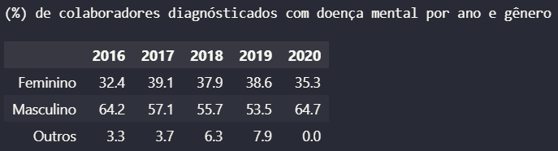
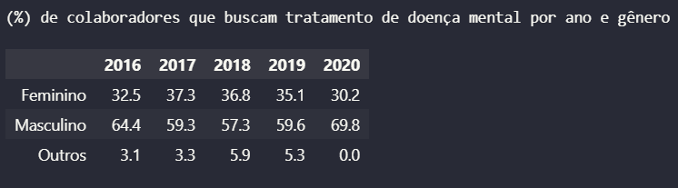
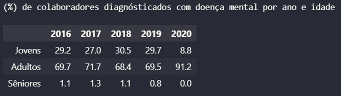
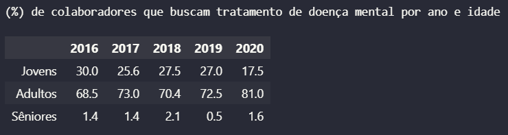
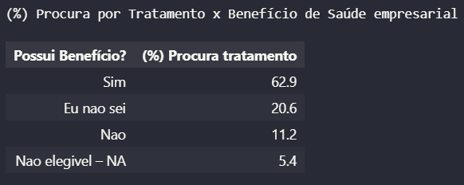
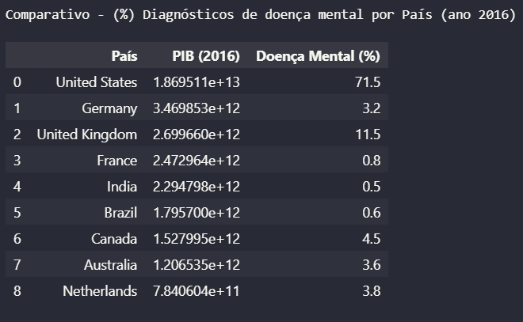

## Análise de Dados da Pesquisa sobre Saúde Mental OSMI (Integração API REST + CSV)

Projeto desenvolvido em Python com foco na integração, tratamento e análise dos dados da pesquisa sobre saúde mental em profissionais da área de tecnologia de diversos países, conduzida pela OSMI. As análises foram complementadas com informações adicionais dos países, obtidas por meio do consumo de uma API REST, e com dados do Produto Interno Bruto (PIB) coletados a partir de um arquivo CSV.

# Etapas do projeto

O projeto é dividido em duas etapas. Na primeira fase, são obtidas informações dos países por meio do consumo de uma API REST e realizada a leitura de dados do Produto Interno Bruto (PIB) a partir de arquivos CSV. Em seguida, as informações são tratadas e integradas em uma única base de dados.

Na segunda fase, é realizado um estudo de caso sobre saúde mental utilizando dados da pesquisa de saúde mental da (OSMI). Os dados de PIB obtidos na etapa anterior são utilizados para complementar as análises, permitindo a integração, limpeza e exploração dos dados com o objetivo de responder às perguntas propostas no estudo de caso.

- Consumo de API REST para obtenção de informações dos países;
- Leitura de arquivos CSV contendo dados do Produto Interno Bruto (PIB);
- Integração de diferentes bases de dados;
- Tratamento e limpeza dos dados;
- Preparação dos dados para análise;
- Análise exploratória dos dados;
- Geração de indicadores para apoiar a compreensão dos dados e responder às perguntas do estudo de caso.

# Perguntas do Estudo de Caso

**1. Existe uma diferença significativa de saúde mental entre os gêneros de colaboradores ao longo do tempo em que a pesquisa foi realizada?**

O gênero masculino permaneceu entre os gêneros de colaboradores com os maiores percentuais de diagnóstico de doença mental em todos os anos de aplicação da pesquisa. Os valores variaram de 64.2% em 2016 para 57.1% em 2017, chegando ao menor percentual  em 2019 (53.5%). Em 2020, observa-se novamente um aumento para 64.7%.

O gênero feminino apresentou percentuais bem próximos de um ano para o outro. Com um aumento inicial de 32.4% em 2016 para 39.1% em 2017. A partir de 2018 os percentuais ocilaram, mas sem grandes diferenças. Em 2020 é possível perceber uma queda para 35.3% de mulheres colaboradoras diagnósticadas com doença mental.

A categoria “Outros” mostrou uma evolução de representatividade gradual, passando de 3.3% em 2016 para 7.9% em 2020. Esta categoria sempre se manteve com os menores percentuais dentre as categorias de gênero de colaboradores com doença mental ao longo dos anos. Esse baixo percentual, pode ser explicado devido a representatividade da amostra, pessoas que não se identificam como gênero masculino ou feminino são uma minoria em todos os anos de aplicação da pesquisa.

Importante destacar que, foram identificados valores ausentes na coluna de gênero, o que pode indicar uma falha na coleta ou até mesmo uma não obrigatoriedade de preenchimento.

Ao comparar os percentuais entre os gêneros ano a ano, observa-se que as maiores diferenças entre homens e mulheres ocorreram em 2016 e 2020. Em 2016, a diferença foi de 31.8 pontos percentuais e em 2020 de 29.4. Já entre 2017 e 2019, essa diferença diminuiu bastante ficando entre 14.9 e 18 pontos percentuais, em parte devido ao crescimento da categoria “Outros”.

De forma geral, há uma diferença clara e significativa na quantidade de diagnósticos de doença mental entre os gêneros, com oscilações ao longo dos anos. Ainda assim, o padrão permanece consistente: em todos os períodos analisados, o gênero masculino apresenta os percentuais mais elevados de diagnóstico.

**2. Existe uma diferença significativa de quem busca tratamento entre os gêneros de colaboradores ao longo do tempo em que a pesquisa foi realizada?**

Em relação à busca por tratamento de doença mental, observa-se novamente que o gênero masculino apresenta, em todos os anos analisados, os maiores percentuais.

O gênero feminino mantém percentuais mais estáveis, variando entre 30.2% e 37.3% ao longo dos anos. A categoria "Outros" aparece com os menores percentuais de busca por tratamento, com destaque para 2018 (5.9%) e 2019 (5.3%), que foram os anos de maior procura dentro dessa categoria. Apesar desse aumento pontual, a representatividade é relativamente menor que as demais.

Assim como na análise dos diagnósticos, os anos de 2016 e 2020 são aqueles em que há maior diferença entre homens e mulheres na busca por tratamento. Em 2016, essa diferença foi de 31.9 pontos percentuais, e em 2020 foi de 39.6 pontos percentuais. Entre 2017 e 2019, a diferença entre os gêneros diminui também em parte devido ao aumento da categoria "Outros".

De forma geral, há sim uma diferença significativa entre os gêneros ao longos dos anos. Além disso, os dados mostram que o padrão observado nos diagnósticos se repete na busca por tratamento: o gênero masculino permanece como o gênero com maior representatividade em todos os anos, havendo oscilações no percentual de diferença entre os gêneros. Ou seja, o padrão se mantém, mas a distância entre os gêneros não é estável, ela varia ao longo do tempo.

**3. Existe uma diferença significativa de saúde mental entre as idades dos colaboradores ao longo do tempo em que a pesquisa foi realizada?**

A partir dos resultados, é possível observar que os profissionais Adultos, entre 30 e 59 anos, concentram o maior percentual de diagnósticos de doença mental em todos os anos da pesquisa. Os percentuais variam de 68.4% a 91.2%.

O ano de 2017 se destaca, com 71.7% dos diagnósticos pertencendo aos Adultos, em comparação a 27.0% dos Jovens e 1.3% dos Sêniores. Já em 2020, a diferença entre Adultos (91.2%) e Jovens (8.8%) chega a 82.4 pontos percentuais, representando a maior diferença percentual observada entre essas duas faixas de idade.

Os Jovens, entre 18 e 29 anos, apresentam percentuais relativamente estáveis entre 2016 e 2019, oscilando entre 27.0% e 30.5%, mas com uma queda brusca para 8.8% em 2020.

Já os Sêniores, entre 60 e 74 anos, mantêm percentuais muito baixos durante todo o período, variando de 0.0% a 1.3%.

De forma geral, os resultados indicam diferenças significativas entre as faixas etárias, com oscilações relevantes ao longo dos anos. Ainda assim, o padrão permanece: os Adultos são o grupo com maior percentual de diagnósticos de doença mental em todos os anos analisados.

**4. Existe uma diferença significativa de quem busca tratamento entre as idades dos colaboradores ao longo do tempo em que a pesquisa foi realizada?**

Conforme os resultados obtidos, ao analisar as faixas etárias na busca por tratamento de doença mental, observa-se que os Adultos continuam com os maiores percentuais em todos os anos. Os valores variam entre 68.5% e 81.0%, reforçando a predominância dessa faixa etária na procura por tratamento.

O ano de 2020 apresenta a maior diferença percentual entre Adultos e Jovens. Nesse ano, 81.0% dos adultos buscaram tratamento, enquanto os jovens apenas 17.5%, que foi  o menor percentual da faixa Jovem em todo o período analisado.

Os Sêniores mantêm a menor representatividade ao longo dos anos, variando entre 0.5% e 2.1%. O ano de 2018 foi o ano em que essa faixa apresentou seu maior percentual (2.1%), ainda assim muito inferior às demais faixas.

Em 2016, os Jovens registraram 30.0% de busca por tratamento, sendo este o seu maior percentual entre 2016 e 2020.

De forma geral, os resultados mostram diferenças expressivas entre as faixas etárias, com algumas ocilações ao longo dos anos. Ainda assim, o padrão se mantém: os Adultos são o grupo que mais busca tratamento de doença mental em todos os anos analisados.

**5. Os funcionários de empresas que possuem benefícios de saúde para tratamento de saúde mental buscam mais tratamento?**

A partir dos resultados, é possível observar que os funcionários que possuem benefício oferecido pela empresa para tratamento de saúde mental são os que mais buscam tratamento, representando 62.9% dos colaboradores.

**6. Existe uma diferença significativa de saúde mental entre países mais ricos (com um PIB elevado) no ano de 2016?**

Sim, com base nos resultados obtidos, é possível observar uma diferença significativa entre os países com maior PIB no ano de 2016. Os Estados Unidos, país com o maior PIB (US\$ 18.7 trilhões), apresentam também o maior percentual de diagnósticos de doença mental, chegando a 71.5% em 2016.

Em seguida aparece o Reino Unido, com 11.5% de diagnósticos, apesar de possuir o terceiro maior PIB entre os países analisados (US\$ 2.69 trilhões). Já a Alemanha, que detém o segundo maior PIB (US\$ 3.46 trilhões), apresenta apenas 3.2% de diagnósticos.

França (0.8%) e Índia (0.5%), mesmo com PIBs elevados, registram percentuais muito baixos.

# Fonte dos Dados

Os dados utilizados neste projeto foram fornecidos pela instituição de ensino, a partir dos dados da OSMI: https://osmhhelp.org/research.html
Os dados foram utilizados exclusivamente para fins acadêmicos, no contexto da disciplina de Coleta e Preparação de Dados em novembro de 2025.